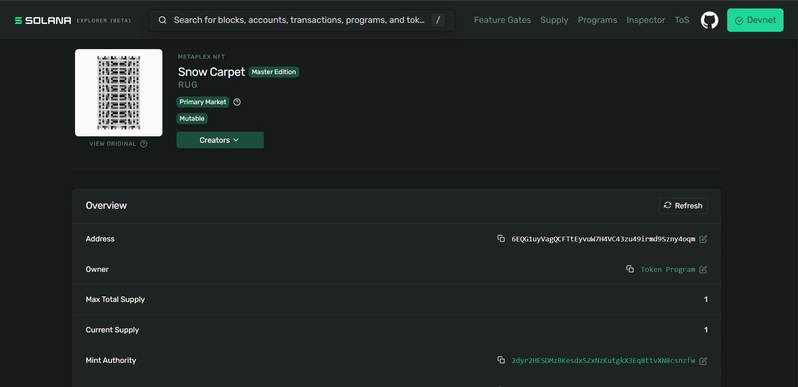

# Metaplex Standard NFT Image, Metadata, Mint and Transfer

---

## NFT Credentials

|  | Address / Hash|
| :--- | :--- |
|**Mint Address** | `6EQG1uyVagQCFTtEyvuW7H4VC43zu49irmd9Szny4oqm` |
| **Mint Tx** | `5oVT67idE7Mf9vppSbvZqnHRGugq6XPPrgsjPrHQffZ53cUPmYe7tHGpDQNsqb6GcNm1aWFB1nDWbjY4fUcbu7rs` |
| **Transfer Tx** | `dW2QuHeb7hSkyzYdNuWQZ9UUaw2e9xAk7GioBMryFqkqFE4Hc3Xke9f4XYcpaPiEft7cBKWQ55BjnkNHEAW9U6q` |

---

##  Proof of Minting
Below is the screenshot of the NFT and details as seen on the Solana Explorer.

---

## Links
- [NFT](https://explorer.solana.com/address/6EQG1uyVagQCFTtEyvuW7H4VC43zu49irmd9Szny4oqm?cluster=devnet)
- [MINT-TX](https://explorer.solana.com/address/6EQG1uyVagQCFTtEyvuW7H4VC43zu49irmd9Szny4oqm?cluster=devnet)