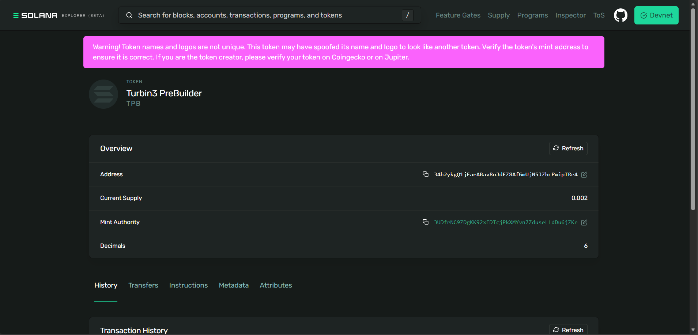

# SPL Token Minting & Transfer

This repository contains my submission for the **Mint and Trade SPL Tokens** objective. It demonstrates minting a custom token on the Solana Devnet and setting up the necessary token accounts.

---

##  Token Credentials

|  | Address / Hash|
| :--- | :--- |
|**Token Address** | `34h2ykgQ1jFarABav8oJdFZ8AfGmUjN5JZbcPwipTRe4` |
| **Mint Tx** | `5f2tWeJBZESEvyHzdv5yHpc2jCyG492hHBdFy7mhkQrR2L3HbRnJNix3FARm7dH61KwDSo8KabjZ3Zqq14g6Zxyr` |
| **Mint ATA** | `4G5uk9dGryeeh95M5UD8HTKTkUZf7dKwFsh4LfC7ur3R` |

---

##  Proof of Minting
Below is the screenshot of the token supply and details as seen on the Solana Explorer.

---

## Implementation Details
- **Environment:** Solana Devnet
- **Framework:** `@solana/web3.js` & `@solana/spl-token`
- **Source Code:** Found in `ts/cluster1/`

### Steps Completed:
1. Created a unique **Mint ID**.
2. Created an **Associated Token Account (ATA)** for the wallet.
3. Minted a supply of tokens to the ATA.
4. Verified the transaction hash: `5f2tWeJBZESEvyHzdv5yHpc2jCyG492hHBdFy7mhkQrR2L3HbRnJNix3FARm7dH61KwDSo8KabjZ3Zqq14g6Zxyr`

---

## Links
- [View on Solana Explorer](https://explorer.solana.com/address/5f2tWeJBZESEvyHzdv5yHpc2jCyG492hHBdFy7mhkQrR2L3HbRnJNix3FARm7dH61KwDSo8KabjZ3Zqq14g6Zxyr?cluster=devnet)
