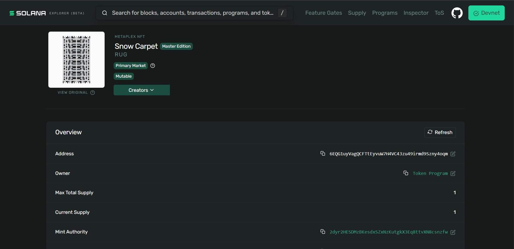

# Solana Starter Kit: Turbin3 Cohort

A comprehensive collection of Solana scripts and programs developed during the Turbin3 (formerly WBA) cohort. This repository covers the transition from basic wallet operations to advanced NFT minting, SPL token management, and secure vault interactions.

---

## 🚀 Featured Project: Metaplex Standard NFT
A fully functional implementation of the Metaplex standard for minting and transferring NFTs on Solana Devnet.

### NFT Credentials
| Property | Address / Hash |
| :--- | :--- |
| **Mint Address** | `6EQG1uyVagQCFTtEyvuW7H4VC43zu49irmd9Szny4oqm` |
| **Mint Tx** | `5oVT67idE7Mf9vppSbvZqnHRGugq6XPPrgsjPrHQffZ53cUPmYe7tHGpDQNsqb6GcNm1aWFB1nDWbjY4fUcbu7rs` |
| **Transfer Tx** | `dW2QuHeb7hSkyzYdNuWQZ9UUaw2e9xAk7GioBMryFqkqFE4Hc3Xke9f4XYcpaPiEft7cBKWQ55BjnkNHEAW9U6q` |

### Proof of Minting


*View on [Solana Explorer](https://explorer.solana.com/address/6EQG1uyVagQCFTtEyvuW7H4VC43zu49irmd9Szny4oqm?cluster=devnet)*

---

## 📂 Project Structure

### 🛠️ TypeScript Client (`/ts`)
Advanced scripts for interacting with the Solana blockchain using `@solana/web3.js`, `@metaplex-foundation/umi`, and `@coral-xyz/anchor`.

- **`prereqs/`**: Essential scripts for keypair generation, airdrops, and cohort enrollment.
- **`cluster1/`**: 
    - **SPL Tokens**: Initialization, minting, transfer, and metadata management.
    - **NFTs**: Image upload via Irys, metadata creation, and minting using Metaplex Umi.
    - **Vaults**: A robust suite for interacting with a WBA Vault program, supporting SOL, SPL tokens (ATAs), and NFTs.
- **`tools/`**: Utilities for wallet format conversion (JSON <-> Base58).

### 🦀 Rust Program (`/rs`)
Rust-based implementations for the cohort prerequisites and core logic.

- **`prereqs/`**: Rust tests for keygen, airdrops, and WBA program enrollment.
- **`programs/`**: IDL-based program definitions for secure interactions.

---

## 🛠️ Getting Started

### Prerequisites
- Node.js & `pnpm`
- Rust & Cargo
- Solana CLI

### Installation
```bash
# Install TypeScript dependencies
cd ts
pnpm install

# Build Rust components
cd ../rs
cargo build
```

### Usage (TypeScript)
The `package.json` in the `ts` directory provides several commands:

```bash
# Keypair & Wallet Setup
pnpm keygen
pnpm airdrop

# NFT Operations
pnpm nft_image    # Upload image
pnpm nft_metadata # Create metadata
pnpm nft_mint     # Mint the NFT

# Vault Interactions
pnpm vault_init
pnpm vault_deposit
pnpm vault_withdraw
```

---

## 💡 Tech Stack
- **Blockchain**: [Solana](https://solana.com/)
- **Framework**: [Anchor](https://www.anchor-lang.com/)
- **NFT Standard**: [Metaplex](https://www.metaplex.com/)
- **Development**: TypeScript, Rust
- **Storage**: [Irys](https://irys.xyz/) (for NFT assets)

## 🔐 Security Concepts
### Atomic Transactions & Escrows
This repository demonstrates solving **Counterparty Risk** in P2P transfers. Instead of manual transfers where one party must "go first," we utilize **Escrow Vaults** and **Atomic Transactions** to ensure assets are only moved when all conditions are met, eliminating the risk of theft during exchange.
